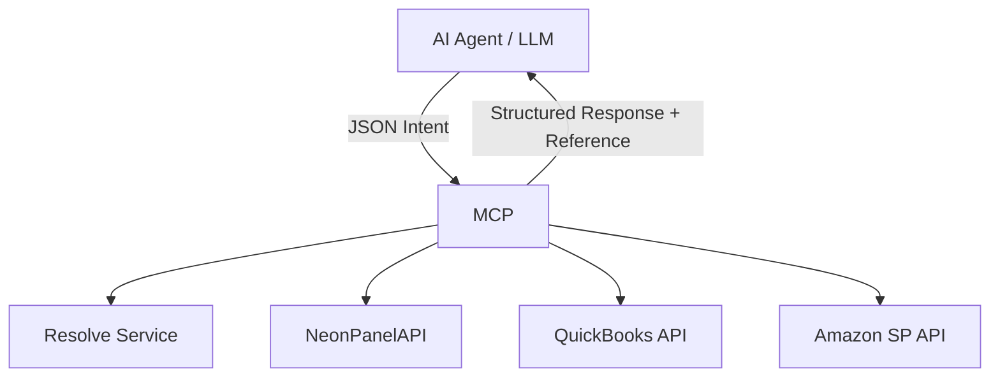

# MCP (Model Context Protocol)

Model Context Protocol (MCP) is an intelligent middleware layer that enables AI agents (such as GPT or external LLMs) to securely and effectively communicate with various backend APIs like NeonPanel, Amazon SP API, QuickBooks, and more.

## ✨ Purpose

MCP serves as a smart translator, router, and security gatekeeper between free-form AI requests and normalized, structured APIs.

---

## 🧠 Core Responsibilities

1. **API Routing**
   - Determines which backend API (NeonPanel, Amazon, QuickBooks, etc.) the request should be sent to based on the intent and data type.

2. **Authentication & Access Control**
   - Extracts `access_token` from the request.
   - Identifies `user_id`, `company_id`, and `roles`.
   - Enforces access levels: public, internal, confidential, restricted, etc.

3. **Entity Resolution**
   - Translates natural-language inputs (e.g. product names, SKUs) into internal system IDs using the `/resolve` endpoint.
   - Supports fuzzy search and filters by company, marketplace, etc.

4. **Caching**
   - Caches resolved IDs and recent API responses to reduce latency and API load.
   - Smart cache keying by `company_id`, `query`, `type`.

5. **API Execution**
   - Constructs valid API calls using resolved IDs and access rules.
   - Chains multiple API calls if needed for complex intents.

6. **Structured Output**
   - Returns clean, structured JSON output to the AI agent.
   - May include `name`, `id`, `source`, and optional explanations.
   - **Optionally includes `reference` objects for links to dashboards, documents, or actions.**

---

## 🔗 Reference Support

MCP can return contextual references to reports, projects, documents, or external services.

### Supported Types:
- `dashboard` – BI dashboards and reports
- `project` – Projects in NeonPanel
- `document` – Internal documents stored in S3/VDB
- `qbo_doc` – Linked QuickBooks Online documents
- `external` – External services (e.g., ShipsGo tracking)

### Example Output:
```json
{
  "result": {
    "inventory_name": "iPhone 13 Pro Max",
    "cost": 725.32,
    "currency": "USD"
  },
  "reference": [
    {
      "type": "dashboard",
      "label": "P&L Report",
      "url": "https://neonpanel.com/dashboards/123"
    },
    {
      "type": "document",
      "label": "Vendor Contract – Apple",
      "url": "https://s3.amazonaws.com/neonpanel/docs/contract-apple.pdf",
      "access_level": "confidential"
    }
  ]
}
```

---

## 🧩 Architecture Overview



---

## 📁 Reference Endpoints

| Endpoint                   | Purpose                                |
|----------------------------|----------------------------------------|
| `/references/dashboards`  | BI dashboards and analytical reports   |
| `/references/projects`    | Projects in NeonPanel                  |
| `/references/documents`   | Documents stored in S3 or VDB          |
| `/references/qbo`         | QBO financial document links           |

---

## 📈 Performance Expectations

| Request Type                   | Target Latency |
|-------------------------------|----------------|
| Cached resolve                | 50–150 ms      |
| Single API call               | 100–400 ms     |
| Resolve + API call            | 300–800 ms     |
| Multi-step / external API     | 800–3000 ms    |

---

## 📦 Future Extensions

- Asynchronous job handling (`task_id` + polling or webhook)
- Plugin system for third-party API integrations
- Metrics, logging & observability
- Retry logic, fallback sources
- Streaming responses (for large outputs)

---

## 📜 License

MIT License (or your project-specific license)
